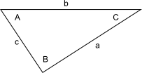

% 6G5Z3001_1314 \\\\ Mathematical Methods
% Killian O'Brien
% Oct 2013
# Multi-variable calculus

## Multi-variable calculus \\\\ Example problems

1. Demonstrate that the function $\phi$ defined by $$\phi(x,y)=e^x \sin(y)$$ is a solution of the Laplace's partial differential equation 
$$ \frac{\partial^2 \phi}{\partial x^2} + \frac{\partial^2 \phi}{\partial y^2} = 0.$$

2. Demonstrate that the function $\psi$ defined by 
$$\psi(x,y,t) = e^{-t} \left ( \sin x + \cos y \right )$$
is a solution of the partial differential equation 
$$\frac{\partial^2 \psi}{\partial x^2} + \frac{\partial^2 \psi}{\partial y^2} = \frac{\partial z}{\partial t}.$$

3. Find all the locations $(x,y)$ where the two partial derivatives $\frac{\partial f}{\partial x}$ and $\frac{\partial f}{\partial y}$ are simultaneously zero, where $f$ is the function defined by 
$$f(x,y) = \cos \left ( x^2 + y^2 \right ).$$

4. Use the technique of implicit (partial) differentiation to find expressions for $\frac{\partial z}{\partial x}$ and $\frac{\partial z}{\partial y}$ where $x,y,z$ are related by the equation 
$$xy + yz + zx = 1 .$$

5. Consider the 1-dimensional heat equation 
$$\frac{\partial u}{\partial t} - \frac{\partial^2 u}{\partial x^2} = 0$$
which describes the distribution of heat in a region at time $t$. Show that the function $u$ defined by 
$$u(x,t) = e^{- \beta t} \sin(\alpha x)$$
is a solution of the heat equation when a certain relationship holds between the paramenters $\alpha$ and $\beta$.

6. Consider a general triangle with angles $A,B,C$ and sides of length $a,b,c$ as shown

Find an expression that give the rate of change of angle $A$ as the side length $a$ is varied, but $b$ and $c$ kept fixed. To do this make use of implicit differentiation and the cosine formula 
$$a^2 = b^2 + c^2 -2bc \cos A .$$

 
 
 
 
 
 
 <!--- 
 

 </script>
 

[`cloud.sagemath.com`](https://cloud.sagemath.com).
 --->
